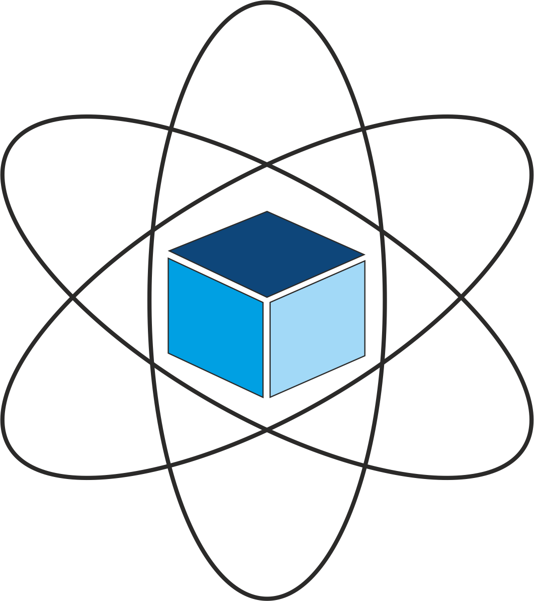

**Status:** Development (expect bug fixes, minor updates and new
environments)

<a href="https://unitary.fund/">
    
</a>

# SciGym

<a href="https://scigym.ai">
    
</a>

**SciGym is a curated library for reinforcement learning environments in science.**
This is the `scigym` open-source library which gives you access to a standardized set of science environments.
Visit our webpage at [scigym.ai]. This website serves as a open-source database for science environments: A port where science and reinforcement learning meet.

## Basics

This project is in line with the policies of the [OpenAI gym]:

There are two basic concepts in reinforcement learning: the environment
(namely, the outside world) and the agent (namely, the algorithm you are
writing). The agent sends `actions` to the environment, and
the environment replies with `observations` and
`rewards` (that is, a score).

The core `gym` interface is [Env], which is the unified
environment interface. There is no interface for agents; that part is
left to you. The following are the `Env` methods you should know:

* `reset(self)`: Reset the environment's state. Returns `observation`.
* `step(self, action)`: Step the environment by one timestep. Returns `observation`, `reward`, `done`, `info`.
* `render(self, mode='human', close=False)`: Render one frame of the environment. The default mode will do something human friendly, such as pop up a window. Passing the `close` flag signals the renderer to close any such windows.

## Installation

You can perform a minimal install of `scigym` with:

  ```sh
  git clone https://github.com/hendrikpn/scigym.git
  cd scigym
  pip install -e .
  ```
You will need `pyglet` to render some environments.

## What's new

- 2019-08-06: Added [teleportation](https://github.com/HendrikPN/scigym/tree/master/scigym/envs/quantum_physics/quantum_computing/teleportation) environment
- 2019-07-21: Added standardized unit testing for all scigym environments.
- 2019-03-04: Added <a href="https://github.com/R-Sweke/gym-surfacecode">surfacecode</a> environment.
- 2019-02-09: Initial commit. Hello world :)

  [image]: https://img.shields.io/badge/Supported%20By-UNITARY%20FUND-brightgreen.svg?style=for-the-badge
  [OpenAI gym]: https://github.com/openai/gym
  [scigym.ai]: https://scigym.ai
  [Env]: https://github.com/openai/gym/blob/master/gym/core.py
